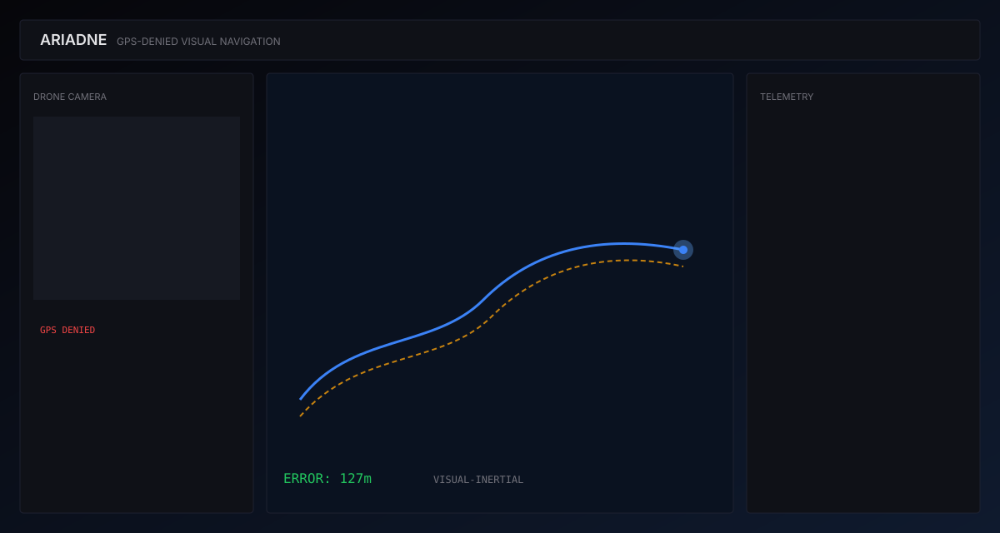
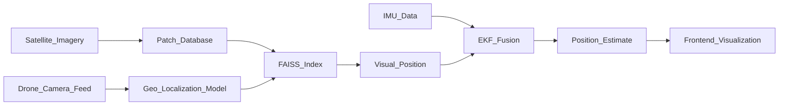

# ARIADNE

**GPS-denied visual-inertial navigation for autonomous drone systems**

[](https://github.com/vishanthashok/ariadne/actions/workflows/test.yml)


ARIADNE is a visual-inertial navigation system that enables autonomous drones to determine their position using terrain matching when GPS is denied.

> Named after Ariadne, who gave Theseus a thread to navigate the labyrinth when no map existed. This system gives a drone a *thread* — visual terrain matching — when GPS is jammed.



*Mission console: drone feed, satellite matches, fused trajectory, and telemetry (open the app in demo mode to see it live).*

---

## Why This Exists

Ukraine’s Ministry of Defence has publicly prioritized equipping frontline drones with computer-vision navigation as GPS jamming and spoofing degrade satellite fixes in contested airspace. Open reporting from CSIS, Forbes, and Ukrainian officials documents widespread EW effects on commercial and tactical UAS. ARIADNE is a **proof-of-concept** built only with public data and synthetic terrain — not classified information — to demonstrate visual geo-localization + IMU fusion end-to-end.

---

## Architecture



---

## Quick Start

```bash
git clone https://github.com/vishanthashok/ariadne.git
cd ariadne
cp .env.example .env        # add Mapbox / Sentinel keys if you have them
make setup                  # install Python + frontend deps
make download-data          # synthetic terrain (or Sentinel if configured)
make process-data           # patches, pairs, FAISS, IMU
make train                  # train geo-localization model (CPU-friendly defaults)
make serve-api              # backend on :8000
make serve-frontend         # UI on :3000
```

Open http://localhost:3000

Docker (API + frontend):

```bash
cp .env.example .env
docker compose up --build
```

---

## Demo Mode

Most visitors will not run the Python ML stack. The frontend **automatically falls back** to `frontend/public/demo/simulation.json` when the WebSocket API is unavailable. All panels, charts, GPS-jamming toggle, and noise controls work in demo mode.

```bash
make generate-demo   # regenerate the 1000-frame recording
cd frontend && npm run dev
```

Optional: set `NEXT_PUBLIC_MAPBOX_ACCESS_TOKEN` in `frontend/.env.local` for live satellite basemap tiles.

---

## Results

After `make train && make evaluate` on your machine you should see metrics printed to the console. Representative targets for this approach on synthetic / Sentinel patches:

| Metric | Target |
|--------|--------|
| Median localization error | &lt; 2 km |
| Recall@1 @ 1 km | reported by `make evaluate` |

Artifacts: `model/checkpoints/error_histogram.png`, `confusion_worst10.png`.

---

## How It Works

**Reference map pipeline** — Pulls or synthesizes regional imagery, slices overlapping geo-referenced patches, and stores ResNet embeddings in FAISS for nearest-neighbor lookup.

**Drone view simulator** — Warps and augments satellite patches into synthetic camera frames at multiple altitudes, plus noisy IMU trajectories for fusion.

**Geo-localization model** — A Siamese ResNet-50 trained with InfoNCE maps drone and satellite views into a shared embedding space; inference queries FAISS for top-k coordinates.

**Sensor fusion** — An Extended Kalman Filter blends intermittent visual fixes with IMU dead-reckoning, widening the confidence ellipse when matches are weak.

**Mission UI** — A single-viewport console streams fused position, match cards, error charts, and EW / jamming state over WebSocket (or demo JSON).

---

## Project Layout

See `build_spec.md` for the full tree. Key entry points:

- `data/scripts/` — download, slice, augment, index, IMU
- `model/` — Siamese net, EKF, train / evaluate / inference
- `api/` — FastAPI + WebSocket simulation
- `frontend/` — Next.js mission console
- `notebooks/walkthrough.ipynb` — recruiter-friendly walkthrough

---

## License

MIT © ARIADNE contributors
