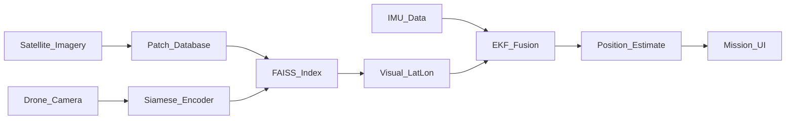

# ARIADNE Architecture

## Overview

ARIADNE is a GPS-denied visual-inertial navigation system. A downward-facing drone camera is matched against a pre-indexed satellite map; an Extended Kalman Filter fuses intermittent visual fixes with IMU dead-reckoning.

## Modules

1. **Reference map pipeline** — download/generate terrain, slice patches, embed, index in FAISS.
2. **Drone view simulator** — augment satellite patches into synthetic nadir/oblique views + IMU flights.
3. **Geo-localization model** — Siamese ResNet-50 + InfoNCE; query FAISS at inference.
4. **Sensor fusion** — EKF state `[lat, lon, vn, ve, heading]` with confidence-scaled measurement noise.
5. **API + UI** — FastAPI WebSocket stream; Next.js three-panel mission console with demo-mode fallback.
